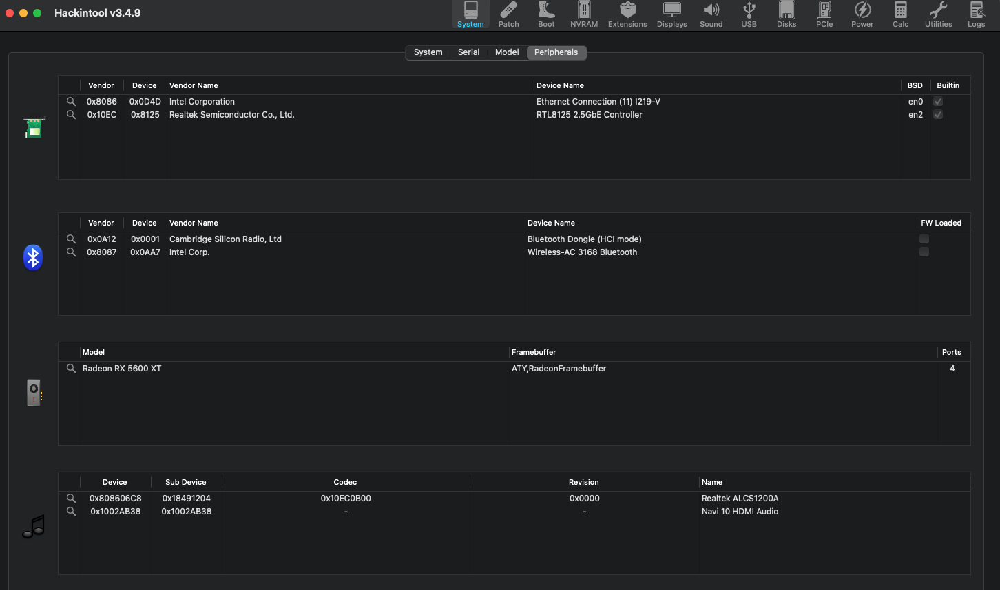
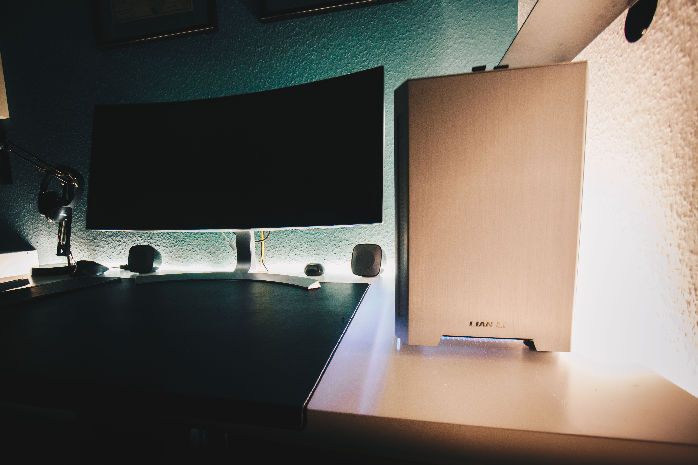

# Hackintosh-asrock-z490-itx/ac
Hackintosh with open-core bootloader 
- Big Sur 11.1 
- Model Name: iMac Pro
- Model Identifier:iMacPro1,1

# Hardware:
- Case: LIAN-LI TU150WA Mini-ITX Case
- Intel i5-10600k
- AsRock Z490 itx/ac:
	- Audio: Realtek ALC1200
	- 1.Gbit Ethernet Intel i219V 
	- 2.5Gbit Ethernet RTL 8125BG 
	- Two USB-C ports (I can not use the front USB-C connection because the matching port on the motherboard is missing) 
	- USB 2.0/3.0 Ports 
- RAM: 16GB Corsair Vengeance DDR4-3200 CL16 Dual Kit
- GPU: ASRock Radeon RX 5600 XT Phantom Gaming 6GB
- 2x Noctua NF-F12 PWM 120mm
- NZXT M22 water cooler 120mm
 
# BIOS-Settings: 
Disable:
- Fast Boot
- Secure Boot
- CSM Support
- Intel Platform Trust
- INTEL SGX 
- VT-d
- CFG-Lock 

Enable:
- XHCI Handoff
- Internal Graphics

# What works:
- [x] All-Motherboard Features(Ethernet-Ports,USB-Layout...)
- [x] Sleep/Wake 
- [x] App-Store
- [x] Audio (Output/Input) 
- [x] Restart/Shutdown 
- [x] Printer 
- [x] All-Motherboard Features(Ethernet-Ports,USB-Layout...)
- [x] Bluetooth 
- [x] Multiboot (Windows 10) 

# What not works:
- WIFI

Solution for wifi and bluetooth for a hackintosh:
https://www.amazon.de/-/en/Hac…-Continuity/dp/B083YXS7VF

# Kext: 
- AppleALC.kext
- IntelMausi.kext
- Lilu.kext
- LucyRTL8125Ethernet.kext
- SMCProcessor.kext
- SMCSuperIO.kext
- VirtualSMC.kext
- WhateverGreen.kext

# Photos from the setup: 

# Links
- https://www.hackintosh-forum.de/forum/thread/48885-guide-msi-meg-z490i-unify-x-igor-slab-kooperation/
